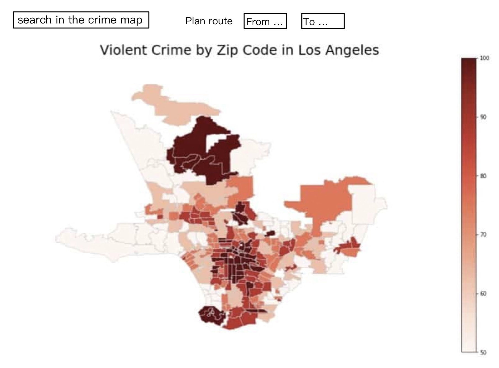

# Project Title: LA CrimeView

## Team Members: 
- Chenbo Duan (chenbod2)
- Haoqi Chen (haoqic2)
- Yangze Liu (yangze2)
- Zhilan Wang (zhilanw2)

### Project Summary

The LA CrimeView project aspires to become a crucial instrument for understanding crime dynamics in Los Angeles by offering an interactive, real-time mapping and analytics platform. Designed to cater to a diverse set of users—including local residents, tourists, businesses, policy makers, and law enforcement agencies—LA CrimeView is committed to enhancing public safety and contributing to informed, data-driven policy decisions. We are intended to provide an intuitive, easy-to-use interface for accessing and visualizing crime data. Our project aims to raise awareness among the public about the safety of different neighborhoods, by enabling real-time tracking of reported crimes.

### Target Audience

- Local Residents
- Tourists
- Local Businesses
- Policy Makers
- Law Enforcement Agencies

### Application Description
The LA CrimeView application aims to provide a real-time, interactive map and analytics platform that offers insights into crime rates across Los Angeles neighborhoods. It is designed to assist tourists, residents, and policy makers alike, the platform addresses the pressing need for reliable, up-to-date information on neighborhood safety. Users can utilize it to make informed decisions on travel itineraries, residential choices, and safer routes for nighttime activities. By offering a user-friendly interface to navigate complex crime data, LA CrimeView seeks to enhance public safety and facilitate more informed, data-driven decisions.

### Usefulness
The application serves a critical need by empowering multiple stakeholders—residents, policy-makers, and law enforcement agencies—with data-driven insights into crime trends in their area. Its primary utility is to inform, predict, and ultimately help reduce crime rates.
Even though similar applications and various platforms are provided by local law enforcement agencies, offering insights into reported crimes, some advanced platforms even provide basic analytics and heatmaps to visualize crime rates. We plan to allow users to contribute to the dataset, which can include commenting on locations as "safe" or "unsafe," reporting a crime, and even contributing to a more dynamic and comprehensive dataset.

### Basic Functions

1. **Interactive Map**: A user-friendly map interface to view real-time and historical crime data.
2. **Search and Filters**: Users can filter crime data based on type, time, and location.
3. **Delete / Insert**: This project empowers users to efficiently manage crime data by allowing them to delete false entries or insert new incidents.
 

### Creative Component

A creative component we're considering is a "Community Annotation" feature, where users can add comments directly to the map. These could range from safety tips to personal experiences, providing context to the existing crime data. Leveraging existing mapping libraries, this feature aims to foster community engagement and collective safety.

### Realness
The dataset "Crime in Los Angeles Data from 2020 to Present" could be find on Kaggle. It contains information related to criminal activities in Los Angeles, spanning from the year 2020 to the present.
Link to the dataset:
https://www.kaggle.com/datasets/susant4learning/crime-in-los-angeles-data-from-2020-to-present

### Data Description

The dataset "Crime in Los Angeles Data from 2020 to Present" contains information related to criminal activities in Los Angeles, spanning from the year 2020 to the present. It offers a comprehensive view of crime-related data in LA, allowing for a detailed examination of crime types, their temporal patterns, spatial distribution, and their association with specific geographic areas within the city. 

Here are some of the attributes that was included in the dataset:
- Crime Types: Information on various types of crimes such as theft, burglary, robbery, assault, etc.
- Date and Time: Data related to when these crimes occurred.
- Location: Geographical coordinates or addresses where the crimes took place, allowing for mapping and spatial analysis. Locations with incomplete data are recorded as coordinates (0°, 0°). 
- Area Name: The 21 Geographic Areas or Patrol Divisions are given a name designation.
- Victim / Suspect Information: Details about the victims and suspects involved in each crime.

### Technologies

1. **Frontend**: HTML
2. **Backend**: Python
3. **Database**: SQL

### A low-fidelity UI mockup

### Project work distribution
1. **Frontend**: HTML: Haoqi Chen (haoqic2)
2. **Backend**: Python: Yangze Liu (yangze2)
3. **Database**: SQL: Zhilan Wang (zhilanw2), Chenbo Duan(chenbod2)

